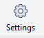

# Quand a-t-on besoin de faire ca?
- Si vous avez des problèmes à clone/fetch/push/pull/etc et que le projet à été déplacé sur gitlab. Vous devriez avoir reçu un courriel avec la commande à exécuter pour changer l'url du projet.
- Quand vous changez de protocole entre HTTP et SSH ([en savoir plus](Configuration-SourceTree-avec-clée-SSH))


# Comment faire?


## En command-line

+ Vous devriez avoir reçu un courriel avec la commande à exécuter pour changer l'url du projet.
+ Il faut exécuter la commande à la racine du projet.
+ La commande ressemble à ce qui suit:  

```bash
git remote set-url origin ssh://git@git.sarbakan.com:10023/sarbakan/<groupes>/<projet>.git
```


## Avec SourceTree
Comme la ligne de commande peut etre intimidante, voici comment le faire dans SourceTree:
- 1: Accéder aux copnfigurations du projet  


- 2: Modifier l'URL dans l'onglet `remotes`  

