[Retour](home)

### Sommaire

Ce document vous présente les différents environnements dans lesquels peuvent vivre des changements git. Toutes forme de modification, ajout ou suppression est enregistré dans git comme un changement. Nous verrons dans cet article quels sont les divers environnements et comment ils interagissent entre eux.

### Préalables

Les instructions et recommandations dans cet article assument que vous avez un projet de cloné sur votre poste ainsi que l'authentification de base pour communiquer avec le serveur Gitlab. Pour plus d'info, voyez [ce pdf](pdf/sarbakan_sourcetree.pdf)

# Environements

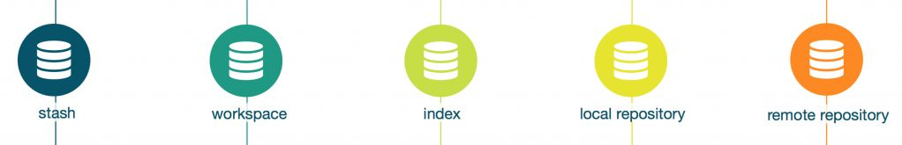

## Workspace

<table><tr>
<td width="120px">
	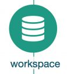
</td>
<td>
C'est ici que votre travail est fait. Dans cet environnement, vous éditez les fichiers du projet avec votre éditeur préféré, avec VSCode, Unity, Maya ou Cubase. Il s'agit de <b>votre copie de travail</b> et c'est aussi ce que vous pouvez naviguer avec l'explorateur de fichiers windows: 
</td>
</tr></table>


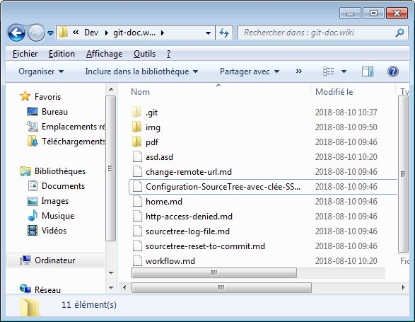

Pensez du Workspace comme votre copie de travail que vous pouvez modifier directement. C'est aussi celle qui sera modifiée lorsqu'on `pull` ou on `checkout`. Le workspace est central à notre workflow de travail, puisqu'il est l'endroit ou toutes vos modification vont avoir lieu. 

On peut le repérer dans SourceTree à l'aide de l'écran de `File Status` ou encore dans l'historique comme une ligne qui est toujours au dessus de la liste au nom de `uncomitted changes`


À partir de cet environnement, on peut passer des changements à l'[index](#index) ou au [stash](#stash).

## Index

<table><tr>
<td width="120px">
	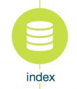
</td>
<td>
L'index représente le <b>Staging Area</b> (Dans SourceTree). Tout ce qui se trouve dans la section <code>Staged Files</code> est considéré dans l'index. C'est une étape nécessaire lorsqu'on veut commiter nos changements.
</td>
</tr></table>


De cet endroit, on peut faire un `commit` pour enregistrer nos changement au [Local Repository](#local-repository) ou les retirer du staging area pour les enlever de l'index. L'index fait partie du [Workspace](#workspace). C'est-à dire, tous les fichiers qui sont dans l'index sont considérés aussi dans le [Workspace](#workspace).

On peut facilement savoir ce qui est dans l'index avec la ligne de commande `git status` en voici un exemple ou on a différents changements dans l'index (`Changes to be committed`).

<table><tr>
<td>
	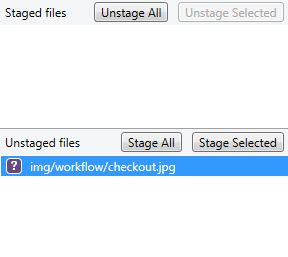
</td>
<td style="height:100%;">
<pre class="code highlight js-syntax-highlight shell monokai" v-pre="true" lang="shell"><code>$ git status 

Changes to be committed:  
modified:   Allo.txt
added:      BenIsAbsolutelyNotLame.txt
removed:    aaaaa.txt
</code></pre>
</td>
</tr></table>

## Local-Repository

<table><tr>
<td width="120px">
	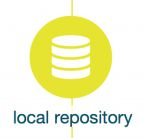
</td>
<td>
Le répertoire local représentes <b>votre historique de commits</b> ainsi que toutes les branches que vous avez déjà <code>checkout</code>.
</td>
</tr></table>

<table><tr>
<td width="210px">
	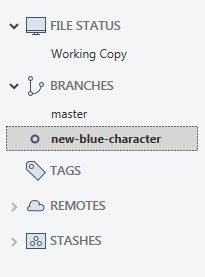
</td>
<td>
Les branches qui font partie de votre répertoire local sont facile à identifier dans la liste de gauche (SourceTree). Elles font partie de la liste de <code>Branches</code>. Quant aux branches du serveur, elles se trouvent dans la liste <code>Remotes</code>.
</td>
</tr></table>

Les opérations `clone`, `push`, `pull` et `fetch` sont essentiellement là pour synchroniser le répertoire local du [répertoire serveur](#remote-repository). Et c'est cette étape qui vous permet de partager votre travail avec vos collègues ainsi que récupérer le leur.

## Remote-Repository

<table><tr>
<td width="120px">
	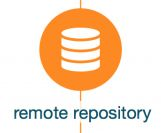
</td>
<td>
Le répertoire distant existe sur notre serveur <a href="https://git.sarbakan.com">Gitlab</a>. Le répertoire distant est le seul endroit que toute l'équipe peut accéder. C'est grâce à lui si on peut partager notre travail avec notre équipe.
</td>
</tr></table>

On peut repérer les branches distantes à l'aide du mot clef `origin` (qui est le nom du remote par défaut). Donc par exemple, la branche `origin/FrankenBranch` peut être repérée dans l'historique de commits par son icone portant son nom. On peut aussi les repérer avec la ligne de commande `git branch --all`

<table><tr>
<td>
	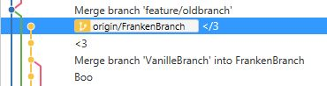
</td>
<td style="height:100%;">
<pre class="code highlight js-syntax-highlight shell monokai" v-pre="true" lang="shell"><code>$ git branch --all
  master
* FrankenBranch
  remotes/origin/master
  remotes/origin/FrankenBranch
</code></pre>
</td>
</tr></table>

Pour qu'on puisse travailler avec le répertoire distant ([Gitlab](https://git.sarbakan.com)), il faut fournir à notre répertoire local un URL. Cet URL est celui que l'on va chercher sur Gitlab et qui sert à faire le `clone`. On doit parfois changer cette adresse comme expliqué dans [cet article](change-remote-url). Cet URL ressemble à quelque chose comme ce qui suit:

```bash
# protocole HTTPS
https://git.sarbakan.com/sarbakan/unity/unity-projects/01733_Playmobil_Crystal_Palace_app.git

# protocole SSH
ssh://git@git.sarbakan.com:10023/sarbakan/unity/unity-projects/01733_Playmobil_Crystal_Palace_app.git
```

## Stash

<table><tr>
<td width="120px">
	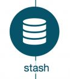
</td>
<td>Le Stash vous permet de mettre temporairement de côté vos changements au <code>workspace</code>. Le Stash est un outil de travail vraiment intéressant. Mais il n'est absolument pas nécessaire afin de travailler.
</td>
</tr></table>

Un stash est un groupe de changements (`change-set`) qui est entreposé à l'extérieur du [Workspace](#workspace) et de l'[Index](#index). Il est très utile lorsqu'on doit effectuer `pull`, un `merge` ou encore lorsqu'on souhaite `commiter` nos changements sur une autre branche. 

Il s'agit donc d'un espace de mémoire pour y stocker des changements afin de nous permettre d'effectuer des opérations qui nécessitent un index vide. Il est comparable à un `commit` qui n'est sur aucune branche et que l'on peut déballer lorsqu'on le souhaite sur n'importe quelle branche.

<table><tr>
<td>
	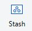
</td>
<td>
<pre style="height:100%;" class="code highlight js-syntax-highlight shell monokai" v-pre="true" lang="shell"><code>$ git stash push -m "un nom de stash"</code>
</pre>
</td>
</tr></table>

On retrouve les stash sur la barre de gauche d'où on peut le déballer *(ou l'appliquer)* sur notre `workspace`. On peut aussi le déballer à l'aide de la ligne de commande `git stash apply`. Appliquer un stash peut nécéssiter un merge si les changements `stashés` entrent en conflit avec le nouvel état de votre workspace. 

<table><tr>
<td>
	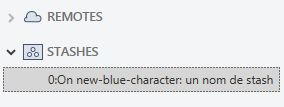
</td>
<td>
<pre style="height:100%;" class="code highlight js-syntax-highlight shell monokai" v-pre="true" lang="shell"><code>$ git stash apply </code>
</pre>
</td>
</tr></table>

# Interactions entre les environnements

Maintenant que vous avez une bonne compréhension des divers environnements par lesquels nos changements peuvent passer, vous comprendrez beaucoup mieux le schéma suivant qui représente les interactions entre les environnements dans git.

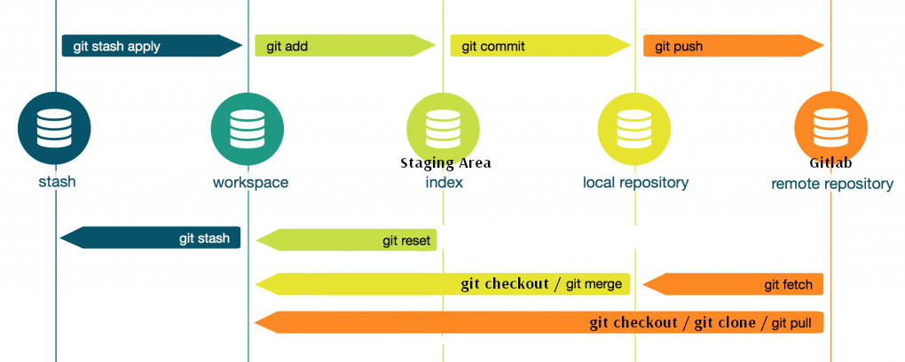

## Pour plus de détails sur les opérations, continuez votre lecture sur le [workflow d'opérations git](git-workflow)
