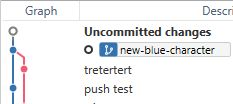
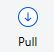
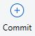
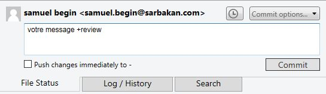
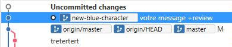
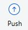
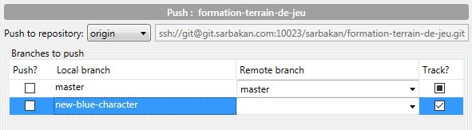

[Retour](home)

### Sommaire

Ce document vous présente une démarche de travail qui s'applique aussi bien au command-line qu'à son utilisation avec SourceTree. Les opérations git seront décrites brièvement ainsi que leur résultats autant en command-line qu'avec Sourcetree.

### Préalables

Les instructions et recommandations dans cet article assument que vous avez lu le dernier article sur [les environments](git-environments). Afin de maximiser la compréhension du sujet exploré, il est fortement conseillé de lire la premiere partie.

# Workflow d'utilisation des opérations Git


Dans cet article seront présenté en ordre d'utilisation (chronologique) les différentes opérations git. Vous pouvez utiliser le schéma précédent afin de faire des références visuelles avec les autres opérations.

## 1: Checkout

Dans SourceTree, le terme `Checkout` n'existe pas. Il suffit de double-cliquer sur une branche ou un commit afin de le `checkout`. Dans l'exemple suivant, la branche `new-blue-character` a été 'checked out'. On peut s'en assurer avec le petit point à gauche ainsi que le nom de branche qui est en gras. 


```bash
# en ligne de commande
$ git checkout new-blue-character

# on peut aussi 'checkouter' un tag ou un commit
$ git checkout v1.0.5
```

On peut aussi le repérer dans l'historique de `commits` avec le point, ou avec la commande `git status`

<table><tr>
<td>
	
</td>
<td>
<pre style="height:100%;" class="code highlight js-syntax-highlight shell monokai" v-pre="true" lang="shell"><code>$ git status
On branch new-blue-character
Your branch is up to date with 'origin/new-blue-character'.
...</code></pre>
</td>
</tr></table>


À partir de ce moment, votre `Workspace` sera à la version choisie (dans ce cas, le dernier `commit` sur `new-blue-character`). Cette opération vous permet de changer de version de logiciel rapidement.


### Attention!

Il est possible que git vous empêche de `checkouter` si les changements nécessaires causeraient des conflits. à ce moment, on vous encourage à `commiter`, `discard` ou `stash` vos changements.

## 2: Pull



```
$ git pull
```

L'opération `pull` ramène les changements du `répertoire distant` sur votre `répertoire local` ainsi que dans votre `Workspace`. Afin de limiter les erreurs, il est **fortement conseillé** de ne pas avoir de changements locaux (non commités). Afin d'atteindre cet état, vous pouvez utiliser `commit`, `discard` ou `stash` pour vider votre `Staging area`.

### Merge conflicts

Il arrive souvent que l'on est plusieurs à travailler sur les mêmes fichiers et qu'on doit merger les conflits lorsqu'un `pull` les changements su `répertoire distant`. Git va tenter d'effectuer un merge si c'est possible automatiquement, mais parfois il a besoin d'une intervention humaine pour terminer un merge.

Lire plus sur le [Merge](merge).

## 3: Travaillez!

Il n'y a pas de règle concernant la quantité approprié de travail à effectuer pour chaque commit. C'est à vous de trouver un équilibre entre le temps travaillé versus le temps passé à la gestion de vos changements. Typiquement, un programmeur fera un commit pour chaque tache JIRA ou pour un groupe de taches qui sont reliés. 

À noter qu'il n'est pas obligatoire de pusher à chaque commit. Donc pour pouvez par exemple faire 5 commits et faire un push à la fin de l'avant-midi.

## 4: Commit



Afin d'effectuer un `commit`, il faut d'abord ajouter nos changements à l'`index` (le `staging-area` dans SourceTree). Suite à cette étape, nous pourront faire notre `commit`

### A: Staging

L'étape d'ajouter nos changement à l'index est assez facile. Il suffit de les monter dans la section `Staged files`. 


Pour la ligne de commande, il y a plusieurs variations de `git add` qui vous aideront à faire cette étape.

```bash
# pour ajouter un ou plusieurs fichiers au staging
$ git add path/to/my/file.txt
$ git add tout-le-contenu/de-ce-dossier/*

# pour faire un "stage all"
$ git add -A

# pour retirer un fichier du staging
$ git reset path/to/my/file.txt
```
vous pouvez en tout temps vérifier l'état de l'index avec `git status`

```bash
# pour vérifier l'état de l'index
$ git status 
On branch workflow
Your branch is ahead of 'origin/workflow' by 1 commit.

Changes to be committed:

	deleted:    asd.asd
	added:      foo.bar

Changes not staged for commit:

	modified:   file.txt
```

### B: Commit

Cette étape est relativement facile. Entrez le message désiré et appuyez sur `Commit`



```bash
git commit -m "votre message +review"
``` 

Suite à cette étape, vous retrouverez votre `commit` dans l'historique. Notez que la branche du répertoire local aura un commit de plus que la branche du répertoire distant. En ligne de commande, il existe plusieurs variétés de `git log` pour nous permettre de vérifier nos commit ou naviguer l'historique.



```bash
$ git log
commit 938d57c39960f16bf6bddb2a6499abcebcde1e87 (HEAD -> workflow)
Author: samuel begin <samuel.begin@sarbakan.com>
Date:   Fri Aug 10 14:36:07 2018 -0400

    votre message +review
...
```

```bash
$ git log --oneline --graph --all
* 938d57c (HEAD -> workflow) votre message +review
* b5bcde5 (origin/workflow) new images and some workflow done
*   5ec96f9 Merge branch 'workflow' of git-doc.wiki into workflow
|\  
| * 00bddc0 asd
* | a475538 new images
|/  
* 4da7cc2 (asd) screenshots from w7 vm
...
```

## 5: Push



Si c'est la première fois que vous 'pushez' du travail sur une branche, il faudra cocher la case appropriée manuellement. Autrement, SourceTree séléctionnera automatiquement la branche sur laquelle vous avez `checkout`.



```bash
# pour une nouvelle branch
$ git push --set-upstream origin new-blue-character

# pour une branche qui existe déjà au serveur
$ git push
```

### Attention!

À cette étape, il est possible que git vous empêche de `pusher`. La plupart du temps c'est parce qu'on doit faire un `pull` en premier afin de récupérer le travail de nos collègues avant d'être en mesure de pusher. Voyez la section à propos de l'opération `pull` plus haut.