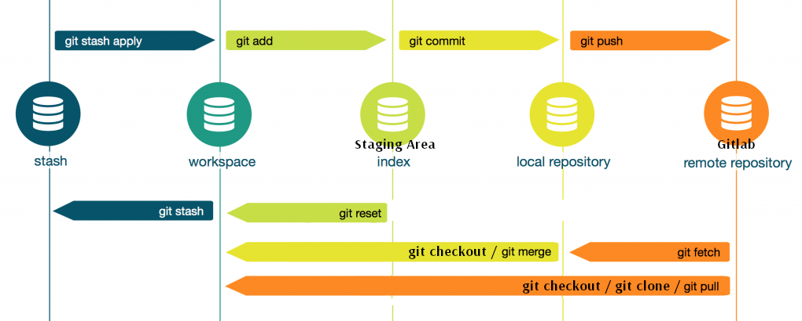
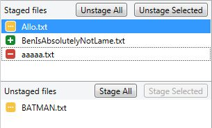

[Retour](home)

### Sommaire

Ce document vous présente une démarche de travail qui s'applique aussi bien au command-line qu'à son utilisation avec SourceTree. Les opérations git seront décrites brièvement ainsi que leur résultats autant en command-line qu'avec Sourcetree.

### Préalables

Les instructions et recommandations dans cet article assument que vous avez lu le dernier article sur [les environments](git-environments). Afin de maximiser la compréhension du sujet exploré, il est fortement conseillé de lire la premiere partie.

# Workflow d'utilisation des opérations Git



Dans cet article seront présenté en ordre d'utilisation (chronologique) les différentes opérations git. Vous pouvez utiliser le schéma précédent afin de faire des références visuelles avec les autres opérations.

## 1: Checkout

Dans SourceTree, le terme `Checkout` n'existe pas. Il suffit de double-cliquer sur une branche ou un commit afin de le `checkout`. Dans l'exemple suivant, la branche `new-blue-character` a été 'checked out'. On peut s'en assurer avec le petit point à gauche ainsi que le nom de branche qui est en gras. 


```bash
# en ligne de commande
git checkout new-blue-character
```

On peut aussi le repérer dans l'historique de `commits` avec le point, ou avec la commande `git status`


```
$ git status
On branch new-blue-character
Your branch is up to date with 'origin/new-blue-character'.
...
```


À partir de ce moment, votre `Workspace` sera à la version choisie (dans ce cas, le dernier `commit` sur `new-blue-character`). Cette opération vous permet de changer de version de logiciel rapidement.


### Attention!

Il est possible que git vous empêche de `checkouter` si les changements nécessaires causeraient des conflits. à ce moment, on vous encourage à `commiter`, `discard` ou `stash` vos changements.

## 2: Travaillez!

## 3: Commit


Afin d'effectuer un `commit`, il faut d'abord ajouter nos changements à l'`index` (le `staging-area` dans SourceTree). Suite à cette étape, nous pourront faire notre `commit`

### Staging

L'étape d'ajouter nos changement à l'index est assez facile. Il suffit de les monter dans la section `Staged files`. 



Pour la ligne de commande, il y a plusieurs variations de `git add` qui vous aideront à faire cette étape.

```bash
# pour ajouter un ou plusieurs fichiers au staging
git add path/to/my/file.txt
git add tout-le-contenu/de-ce-dossier/*

# pour faire un "stage all"
git add -A

# pour retirer un fichier du staging
git reset path/to/my/file.txt
```
vous pouvez en tout temps vérifier l'état de l'index avec `git status`

```bash
# pour vérifier l'état de l'index
$ git status 
On branch workflow
Your branch is ahead of 'origin/workflow' by 1 commit.
  (use "git push" to publish your local commits)

Changes to be committed:
  (use "git reset HEAD <file>..." to unstage)

	deleted:    asd.asd
	added:      foo.bar

Changes not staged for commit:
  (use "git add <file>..." to update what will be committed)
  (use "git checkout -- <file>..." to discard changes in working directory)

	modified:   file.txt
```

### Commit

Cette étape est relativement facile. Entrez le message désiré et appuyez sur `Commit`


```bash
git commit -m "votre message +review"
``` 

## 4: Pull

SourceTree | Command-line
--- | --- | ---
 | `git pull` 

## 5: Merge conflicts

## 6: Push

SourceTree | Command-line
--- | --- | ---
 | `git push` 

```bash
# pour une nouvelle branch
git push --set-upstream origin feature/new-blue-character

# pour une branche qui existe déjà au serveur
git push
```