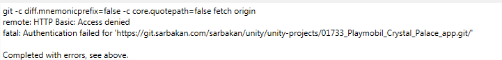
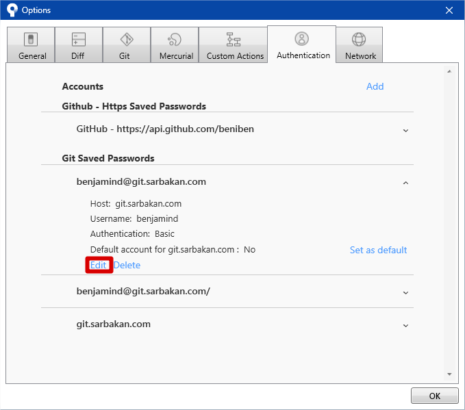

## Ca arrive quand?

Lors d'une opération git comme `push`, `pull` ou même `clone`, on recoit un message similaire à celui-ci:

Souvent on rencontre ce problème suite à la mise à jour du mot de passe windows

## Solutions

### 1: Assurez vous d'avoir entré les bonnes informations!

Assurez vous d'avoir accès à https://git.sarbakan.com/ depuis une fenêtre incognito de Chrome/Firefox. Cela vous permettra de valider si votre nom d'utilisateur et votre mot de passe sont bons.

### 2: Mettre à jour votre mot de passe dans SourceTree

Sourcetree se souviens de votre mot de passe afin de vous alléger la tache de l'entrer à chaque opération. Puisque Gitlab fonctionne avec votre authentification Windows, vous devez changer votre mot de passe enregistré dans SourceTree aussi. Pour ce faire, allez dans les options et jusqu'à cette fenêtre

### 3: Configurer l'authentification par SSH

Vous pouvez changer le mode d'authentification de HTTP à SSH à l'aide de [ce tutoriel](Configuration-SourceTree-avec-clée-SSH). Fortement conseillé, car c'est plus rapide et ça ne cause pas de problème à chaque 3 mois quand on doit changer nos mots de passe