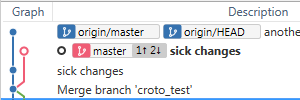
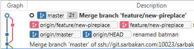
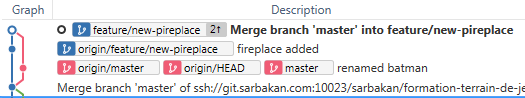
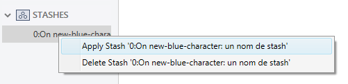
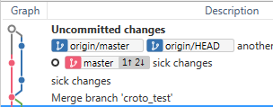
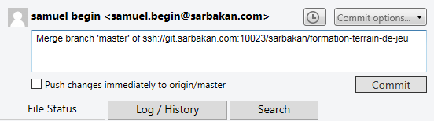
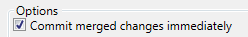
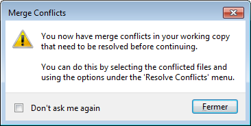
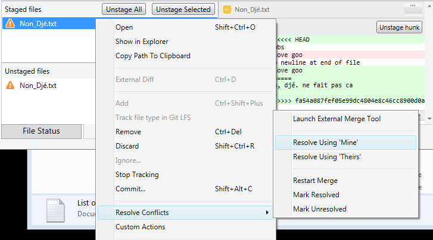
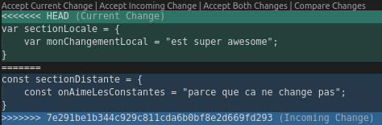

[Retour](home)

### Sommaire

Ce document vous présente les différentes situations ou vous pourriez avoir besoin d'un merge. Les étapes nécessaires y seront détaillées ainsi que plusieurs cas d'utilisation.

# Merger

Merger des changements est une étape qui arrive régulièrement lorsqu'on travail avec les branches dans un logiciel de versionnage. De plus, le concept de branches est beaucoup plus fondamental dans git, donc il est important d'en avoir une bonne compréhension afin de bien utiliser cet outil de travail.

## `Source` et `Destination`

Dans les prochaines sections, nous parleront de branches `source` et branches `destination`. Il est important d'en faire la distinction puisque nous auront besoin de ces informations lors de la résolution d'un conflit. 

Notez qu'en règle générale, nous seront toujours sur la branche `destination` et le contenu que nous voulons rapporter proviendra de la branche `source`. Dans le cas du `pull`, l'analogie fonctionne super bien, puisqu'on "tire" les changements de la `source` sur notre `destination`.

# Quand?

Merger peu être nécéssaire dans plusieurs scénarios. L'étape du merge peut donc apparraître de différentes manières et l'on doit s'en occuper avant de continuer d'autres opératiuons ou résumer notre travail.

## Pull

Lorsqu'on pull, on ramène les changements de la branche `source` du serveur Gitlab (l'origine) sur notre branche `destination` du même nom. Donc `origin/master` sur `master` ou encore `origin/feature/new-fireplace` sur `feature/new-fireplace`.

Pour qu'un merge soit nécessaire, l'état de votre répertoire doit rempolir ces deux conditions:

<table><tr>
<td width="300px">
	
</td>
<td>
    <ul>
        <li> Vous avez des commits locaux que le serveur n'a pas</li>
        <li> La branche du serveur a des changements que vous n'avez pas</li>
    </ul>
</td>
</tr></table>

Dans cette situation, votre `master` local sera la `destination`. Évidemment, la branche du serveur `origin/master` sera la `source`.

## Merge

La plus évidente des sources de `merge` est l'opération qui porte le même nom! Le branche `destination` sera toujours celle qui est ouverte sur votre poste (`checked out`) et la branche `source` est celle que vous choisirez de `merger`. 

Voici les deux cas d'utilisations:

#### Merger `feature/new-fireplace` dans `master`

Si on veut <code>merger</code> une branche par exemple <code>feature/new-fireplace</code> dans <code>master</code>, il faut <code>checkout master</code> pour en faire notre <code>destination</code> et ensuite merger notre branche de feature qui sera la <code>source</code>.

<table><tr>
<td width="390px">
	
</td>
<td style="height:100%;">
<pre class="code highlight js-syntax-highlight shell monokai" v-pre="true" lang="shell"><code>$ git checkout master
$ git merge feature/new-fireplace
</code></pre>
</td>
</tr></table>

#### Merger `master` dans `feature/new-fireplace`

Dans le cas ou on veut mettre à jour notre branche <code>feature/new-fireplace</code> avec les nouveautées de <code>master</code>, il faut <code>checkout feature/new-fireplace</code> pour en faire notre <code>destination</code> et ensuite merger le <code>master</code> qui sera la <code>source</code>.

<table><tr>
<td width="530px">
	
</td>
<td style="height:100%;">
<pre class="code highlight js-syntax-highlight shell monokai" v-pre="true" lang="shell"><code>$ git checkout feature/new-fireplace
$ git merge master
</code></pre>
</td>
</tr></table>

## Rebase

## Stash apply

Dans le cas de l'ouverture d'un `stash` sur votre environnement de travail, la version de votre environnement de travail sera défini comme la `destination` et le contenu du stash sera la `source`.

<table><tr>
<td width="500px">
	
</td>
<td style="height:100%;">
<pre class="code highlight js-syntax-highlight shell monokai" v-pre="true" lang="shell"><code>$ git stash apply
</code></pre>
</td>
</tr></table>

# Comment?

### Préparation

Avant d'effectuer l'opération qui peut nécéssiter un merge, c'est toujours une bonne idée de vider sa section `File Status` (l'`index`). On peut le faire avec un `commit`, un `stash`, ou en enlevant nos changements à l'aide de `discard` et `remove`. De cette manière, vous éliminez les chances de mélanger vos changements locaux avec les chagements de la `source`, qui apparaîtront dans l'`index`.

Cette règle non écrite est une bonne pratique pour toutes les opérations mentionnées plus haut, dont le `pull`, le `merge`, le `rebase` ainsi que le `stash apply`.

## Merger

Lorsque vous avez déclenché un merge, votre section `File Status` (l'`index`) sera populé par les changements provenant de la `source`. Qu'il y ait des conflits ou pas, 

Les indices qui vous aide à déterminer si vous êtes dans un merge sont les suivants:

<table><tr>
<td width="310px">
	
</td>
<td style="height:100%;">
Dans l'historique, vous aurez un graphique similaire à celui illustré à gauche. La section <code>Uncommited changes</code> sera le point de rencontre de deux branches. On peut voir ici que la branche locale <code>master</code> est notre <code>destination</code>, puisqu'elle a le cercle qui représente la branche sélectionnée (<code>checked out</code>). C'est un exemple typique de <code>pull</code>.
</td>
</tr></table>

<table><tr>
<td style="height:100%; text-align:right;">
Un message de commit est déjà composé pour vous. Il contiens la mention d'un <code>merge</code> et un résumé des conflits s'il y en a. Cela nous permet de repérer les <code>merges</code> facilement dans l'historique en regardant les messages de <code>commits</code>.
</td>
<td width="560px">
	
</td>
</tr></table>

Il arrive parfois que SourceTree ne se mette pas tout de suite à jour et il faut donc le faire soi même avec la touche `F5`. Il peut prendre quelques secondes avant de "comprendre" que git est en mode `merge`, tout dépendamment de la quantité de changements à merger.

#### Attention!

Il est important de ne pas mélanger vos changements locaux à ceux d'un merge. Le `commit` d'un `merge` ne doit contenir seulement que les changements qui proviennent de la `source`. Vous pouvez simplement les laisser dans la section à ne pas commiter dans fotre `File status`.

C'est pour cette raison qu'il est fortement recommandé d'appliquer [cette suggestion sur la préparation](#Préparation).

## Merge automatique

L'outil SourceTree vous permet de faire un commit automatiquement si git ne rencontre pas de conflit et n'as pas besoin de l'intervention humaine. On peut trouver cette option sous la forme d'.une case à cocher dans la fenêtre du `pull`. À ce moment, vous n'aurez qu'à terminer les merge qui contiennent des conflits.



En ligne de commande, git le fait déja automatiquement lorsque possible.

## Résolution de conflits

Lorsque git ne peut pas faire un `merge` par lui-même et qu'il a besoin d'une intervention humaine, il fait appel à vos skills avec cette étape que l'on nomme `resolve conflicts`.

<table><tr>
<td width="370px">
	
</td>
<td style="height:100%;">
<pre class="code highlight js-syntax-highlight shell monokai" v-pre="true" lang="shell"><code>$ git pull
...
CONFLICT (content): Merge conflict in Non_Djé.txt
Automatic merge failed; fix conflicts and then commit the result.
</code></pre>
</td>
</tr></table>

À ce moment, vous verrez apparraitre dans votre `index` des fichiers qui ont un icone triangulaire similaire à un panneau d'avertissement.

<table><tr>
<td width="370px">
	
</td>
<td style="height:100%;">
<pre class="code highlight js-syntax-highlight shell monokai" v-pre="true" lang="shell"><code>$ git status 
...
Unmerged paths:
(use "git add <file>..." to mark resolution)
    both modified:   "Non_Djé.txt"
</code></pre>
</td>
</tr></table>

#### Binaires

Pour les fichiers qui ne souvrent pas en format texte, vous avez le choix en deux versions. La version de la `source`, ou la version de la `destination`. C'est à ce moment qu'il est important de distinguer la `source` de la `destination`, puisque dans le menu `Resolve Conflicts`, vous aurez les deux options suivantes:

- `Resolve Using 'Mine'` qui va conserver le fichier à l'état de la `destination`
- `Resolve Using 'Theirs'` qui va conserver le fichier à l'état de la `source`



#### Fichiers texte

Ouvrez votre éditeur de text ou de conflits préféré et effectuez votre merge. Un petit `save`, puis on `stage` le fichier pour continuer avec les autres conflits ou terminer le `commit`.

Dans cet état, le fichier aura des charactères qui sont propres à la résolution de conflits. Si votre éditeur de texte ne les affiche pas de manière personnalisé (avec des options pour les résoudre), vous pouvez facilement distinguer ce qui proviens de la `source` de ce qui est de la `destination`.

```
<<<<<<< HEAD
var sectionLocale = {
    var monChangementLocal = "est super awesome";
}
=======
const sectionDistante = {
    const onAimeLesConstantes = "parce que ca ne change pas";
}
>>>>>>> 7e291be1b344c929c811cda6b0bf8e2d669fd293
```

Exemple avec VSCode:

