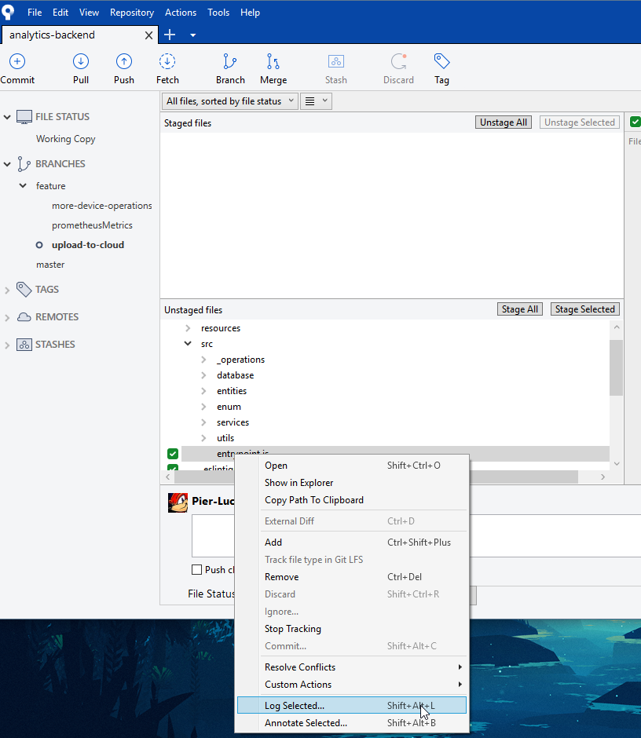

## Étape 1: Trouver le fichier
- Si un changement local est effectué sur le fichier, vous le retrouverez dans l'onglet `File Status`
- avec l'option `All files, sorted by file status` tu vois toute la liste des fichiers, incluant ceux non-modifiés

## Étape 2: Ouvrir le log
- 1: Clic droit sur le fichier  
- 2: Log Selected...

